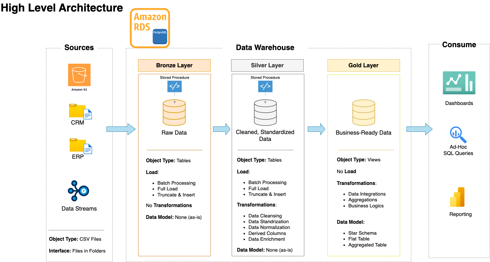

# Martech Data Warehouse Project

## You can explore the visualizations at the following link: [Martech Data Warehouse Streamlit App](https://martech-data-warehouse-project.streamlit.app/)

## Overview

The Martech Data Warehouse Project is designed to build a modern data warehouse utilizing AWS RDS and MS SQL Server. The project incorporates ETL processes, data modeling, and analytics to provide valuable insights from the data.

## Data Warehousing

Data warehousing is a critical component of modern data management, enabling organizations to consolidate data from various sources, transform it into a consistent format, and make it available for analysis and reporting. The process can be likened to a well-organized kitchen where ingredients are sourced, prepared, and used to create dishes.

- **Bronze Layer**: This layer contains raw data ingested from various source systems. The data is stored in its original format without any transformations, similar to sourcing raw ingredients from different suppliers.
- **Silver Layer**: In this layer, the data is cleansed, transformed, and standardized to ensure consistency and accuracy. This is akin to preparing and organizing ingredients, making them ready for cooking.
- **Gold Layer**: The Gold layer contains the final dimension and fact tables, organized in a star schema. This layer is optimized for analytics and reporting, much like using prepared ingredients to create a finished dish that is ready to be served.
- **Data Visualizations**: The final step involves creating visualizations that provide valuable insights and make the data easy to understand, similar to presenting a well-prepared dish to customers.

## Project Architecture

## Medallion Architecture

The data warehouse follows the medallion architecture, which consists of three layers: Bronze, Silver, and Gold.

### Bronze Layer

The Bronze layer contains raw data ingested from various source systems. This data is stored in its original format without any transformations.

### Silver Layer

The Silver layer contains cleansed and transformed data. The data in this layer is enriched and standardized to ensure consistency and accuracy. The transformations performed include:

- Truncating Silver tables before loading data.
- Inserting transformed and cleansed data from Bronze into Silver tables.
- Normalizing values for readability.
- Handling missing or invalid data.

### Gold Layer

The Gold layer contains the final dimension and fact tables, organized in a star schema. This layer is optimized for analytics and reporting. The transformations performed include:

- Creating surrogate keys for dimension tables.
- Combining data from the Silver layer to produce clean, enriched, and business-ready datasets.
- Filtering out historical data to keep only the most relevant information.

## Data Visualizations

The project includes a Streamlit app that provides various visualizations and insights based on the data. You can explore the visualizations at the following link:

[Martech Data Warehouse Streamlit App](https://martech-data-warehouse-project.streamlit.app/)

## Sample Data

The Streamlit app also displays sample data from the fact_sales, dim_products, and dim_customers tables to give viewers an idea of the raw data used in the project.

## Credits

Special thanks to [Baraa](https://www.datawithbaraa.com/) for his teachings which greatly contributed to the understanding of concepts & completion of this project.

## License

This project is licensed under the MIT License.
